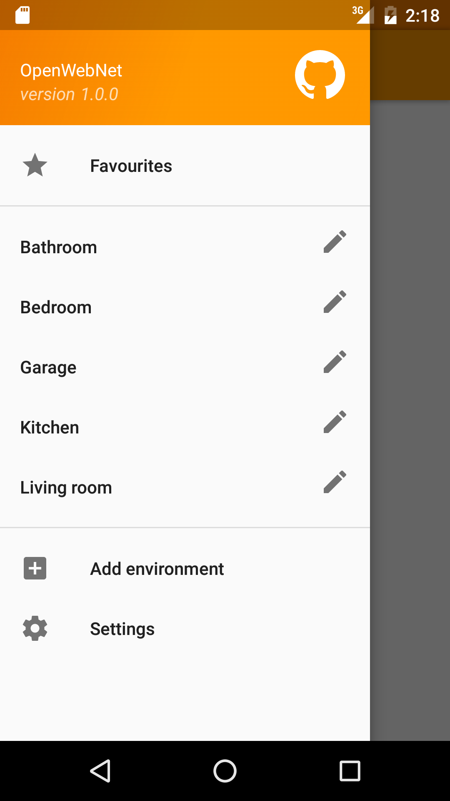
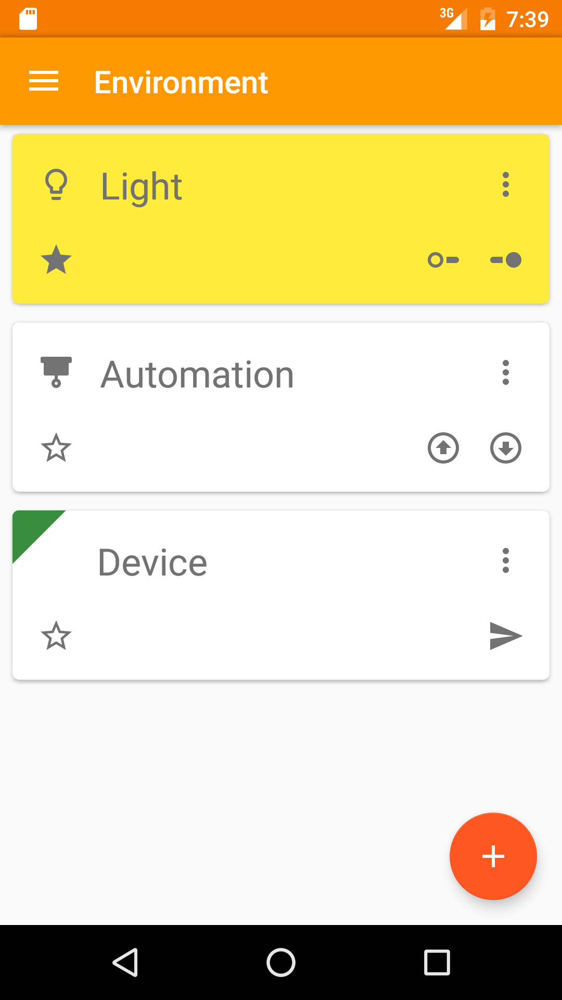
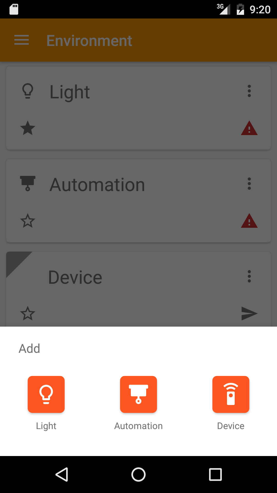
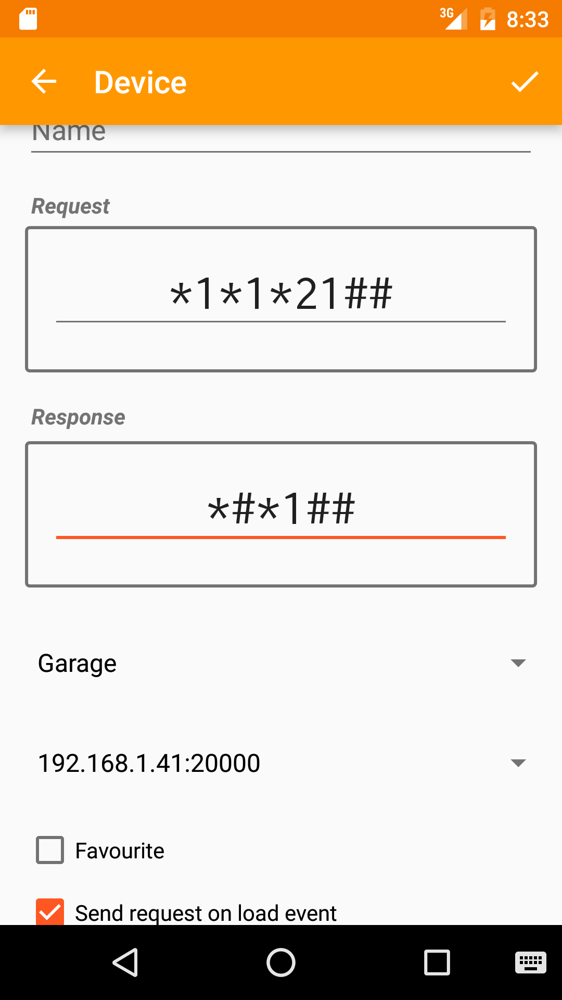
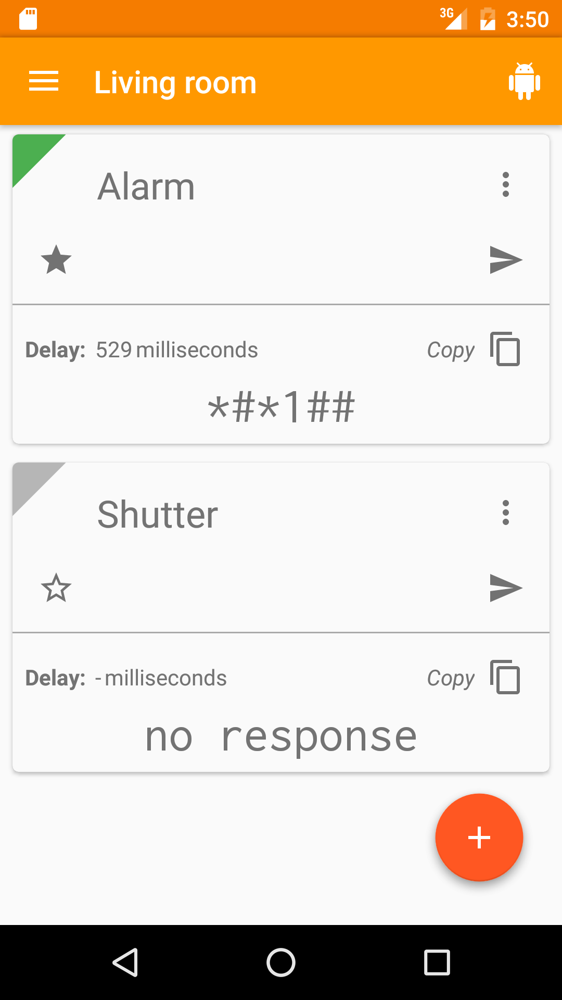
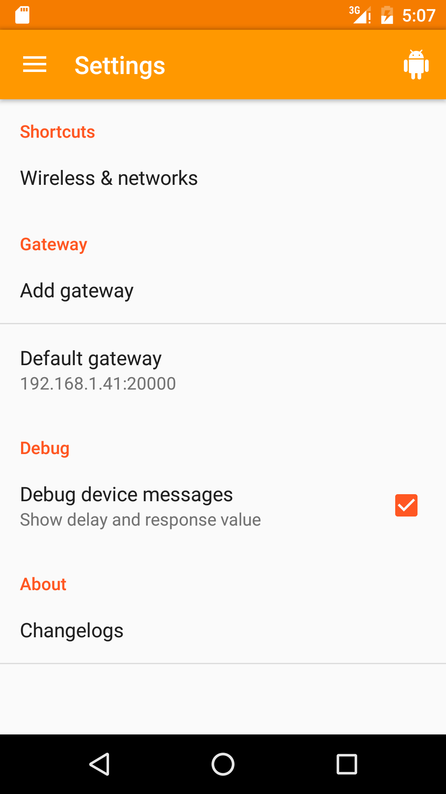

# openwebnet-android 

<!---->

> work in progress!

MyHome is the [BTicino](http://www.bticino.it/domotica-casa-connessa) and [Legrand](http://www.myopen-legrandgroup.com/) home domotic system that let you manage your house from remote devices through [OpenWebNet](https://en.wikipedia.org/wiki/OpenWebNet) protocol.

This Android application is an unofficial free client under CC license available on the Play Store.

It isn't mandatory, but it's highly recommended that you connect to your domotic system using a VPN connection.

### Changelog

#### v2.0.0

- New menu
- Bug fixing
- Minor style changes

#### v1.4.2

- Fix error on android 4.1
- Delete environments
- Minor style changes

#### v1.4.1

- Minor style changes

#### v1.4.0

- Add automation features
- Minor style changes

#### v1.3.0

- Add french language support

#### v1.2.0

- Handle columns on orientation change
- Add italian language support

#### v1.1.0

- Add device debug

#### v1.0.0 and previous releases

- Add/edit environments
- Add gateways
- Show favourites
- Add light features
- Add device features

### License

 openwebnet-android by <a xmlns:cc="http://creativecommons.org/ns#" href="https://github.com/openwebnet" property="cc:attributionName" rel="cc:attributionURL">niqdev</a> is licensed under a <a rel="license" href="http://creativecommons.org/licenses/by/4.0/">Creative Commons Attribution 4.0 International License</a>. Based on a work at <a xmlns:dct="http://purl.org/dc/terms/" href="https://github.com/openwebnet/openwebnet-android" rel="dct:source">https://github.com/openwebnet/openwebnet-android</a>.

### Other contributors
- [Nicolas Moreau](https://github.com/moreau-nicolas)

Thanks to:

* [Dagger 2](http://google.github.io/dagger)
* [Butter Knife](http://jakewharton.github.io/butterknife)
* ~~[Lombok](https://projectlombok.org)~~
* [Retrolambda](https://github.com/orfjackal/retrolambda)
* [Lightweight-Stream-API](https://github.com/aNNiMON/Lightweight-Stream-API)
* [RxJava](https://github.com/ReactiveX/RxJava)
* [Realm](https://realm.io)
* [EventBus](https://github.com/greenrobot/EventBus)
* [ThreeTen](https://github.com/ThreeTen/threetenbp)
* [slf4j + android-logger](http://noveogroup.github.io/android-logger)
* [Robolectric](http://robolectric.org/)
* [mockito](http://mockito.org/)
* [PowerMock](https://github.com/jayway/powermock)
