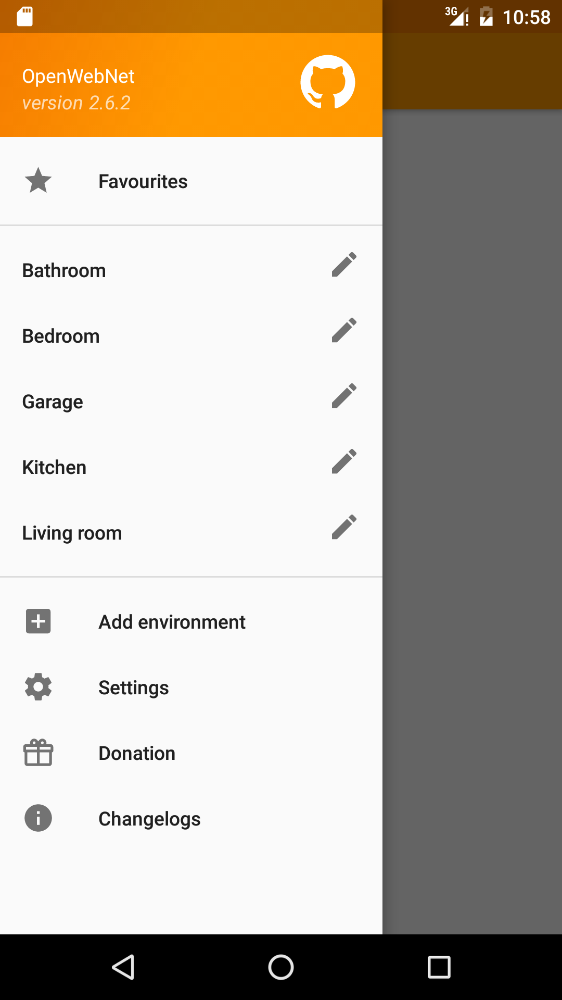
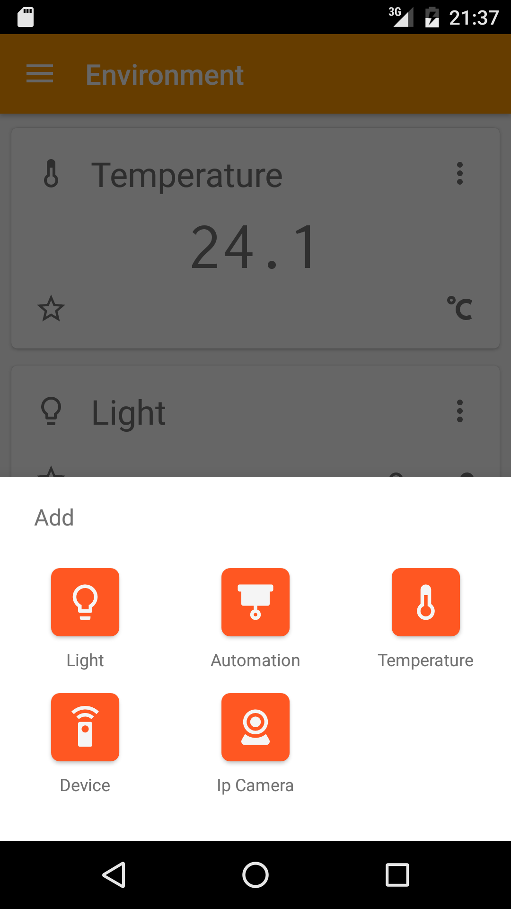
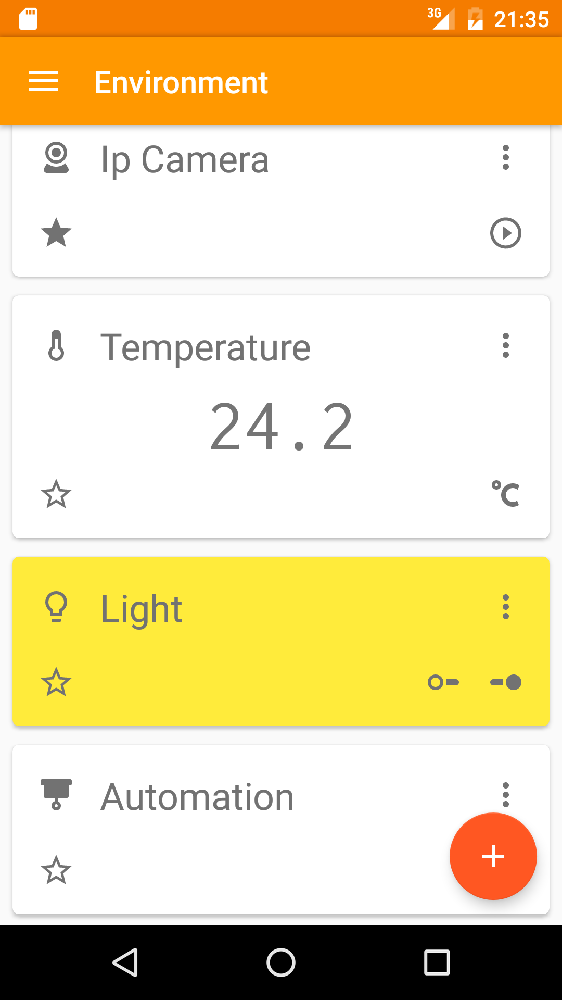
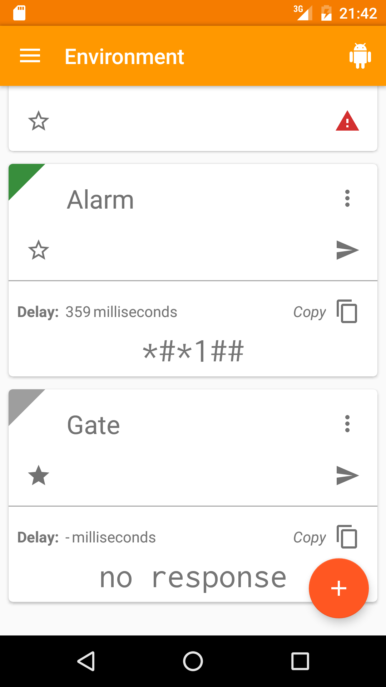
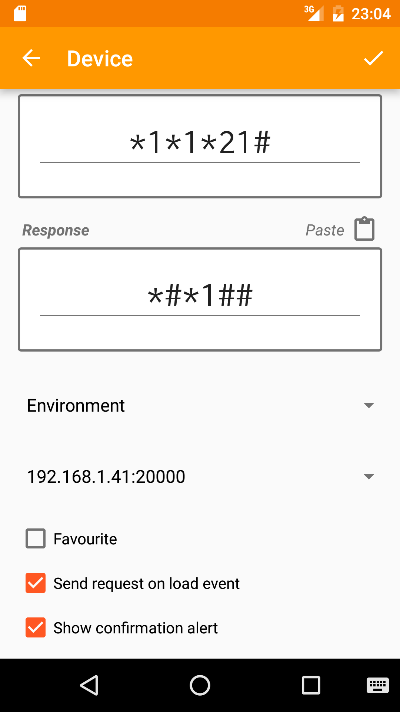

# openwebnet-android 

> work in progress

OpenWebNet Android client for My Home [BTicino](http://www.bticino.it/domotica-casa-connessa) and [Legrand](http://www.myopen-legrandgroup.com/) home automation system

My Home is the BTicino and Legrand home domotic system that let you manage your house from smartphones through [OpenWebNet](https://en.wikipedia.org/wiki/OpenWebNet) protocol.

Manages:
- Lighting
- Automation
- Temperature
- any OpenWebNet frame/message
- Ip Camera (MJPEG)

Handle multiple gateway simultaneously with IP or Domain and password.

It isn't mandatory, but it's highly recommended that you access your domotic system using a VPN connection.

Database encrypted to increase security.

This Android application is an unofficial free and Open Source client under MIT license.

If you like this app and find it useful please consider making a donation. Some possible future improvements:
- Sound System / Radio
- Energy Management
- Quick search and sorting
- Backup / Import / Export configuration

If you find a bug or have any suggestions do not leave a negative rating but contact me via email, I will try to help you.

*OpenWebNet is a BTicino registered trademark*

### Screenshots

### Changelog

All detailed [changelog](CHANGELOG.md).

### Other contributors
- [Nicolas Moreau](https://github.com/moreau-nicolas)
- [terranum](https://github.com/terranum)

Thanks to:

* [Dagger 2](http://google.github.io/dagger)
* [Butter Knife](http://jakewharton.github.io/butterknife)
* ~~[Lombok](https://projectlombok.org)~~
* [Retrolambda](https://github.com/orfjackal/retrolambda)
* [Lightweight-Stream-API](https://github.com/aNNiMON/Lightweight-Stream-API)
* [RxJava](https://github.com/ReactiveX/RxJava)
* [Realm](https://realm.io)
* [EventBus](https://github.com/greenrobot/EventBus)
* [ThreeTen](https://github.com/ThreeTen/threetenbp)
* [slf4j + android-logger](http://noveogroup.github.io/android-logger)
* [Robolectric](http://robolectric.org/)
* [mockito](http://mockito.org/)
* [PowerMock](https://github.com/jayway/powermock)
